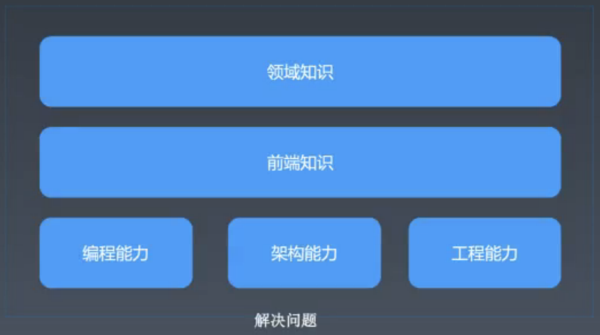

丁文婉 `<1067061570@qq.com>`, v1.0.1,  2020.4.15

[TOC]

# 第一周总结（2020.04.07～ 2020.04.15）

## 课堂笔记

### 4.07 直播笔记——学习方法

前端技能模型：

学习方法：

- 编程能力：
  - 实践中学习
  - 刻意练习、听到了就去学习
  - 建立前端知识体系
- 架构能力：
  - 组件化
  - 学习方法：
  - 看大牛的架构代码
    - 带着目的去读源码，如：去issue找一个bug去解决
- 工程能力：
  - 持续集成
  - 学习方法：
    - 实践

整理法：确保知识的完备性

追溯法：源头—>标准和文档—>大师

随堂作业：用追溯法写一篇关于面向对象的文章 （公开发表）

面试题目类型：

- 项目型问题
- 知识型问题
- 开放性问题
- 案例性问题
- 有趣的问题

技术管理方向的学习侧重点：

- 工程手段对人进行管理

- 关注持续集成

  

### 4.08 直播课笔记 ——构建前端知识体系

具体见脑图：前端知识框架.xmind（后期会不断完善）

参考标准网站:

 https://www.w3.org/

https://whatwg.org/

http://w3school.com/

https://scholar.google.com/

https://developer.mozilla.org/

https://docs.microsoft.com/

https://developer.apple.com/

### 4.11 直播课笔记——构建前端工程体系

优秀的前端：

- 领域知识：形成体系

- 能力：编程能力、架构能力（能做多复杂的事）、工程能力 多少人一起做）

- 潜力：决定走多高，基础越好，走得越远

- 职业规划：阶段目标明确

- 成就：工作/学习成果

职业规划：

- 职业发展
  - 成长->成就->晋升
  - 成就
    - 业务型（业务敏感度）
      - 业务目标
        - 理解公司业务核心目标
        - 目标转化为指标
      - 技术方案
        - 业务指标到技术指标的转化
        - 完成纸面方案、完成小规模试验
      - 实施方案
        - 确定实施目标、参与人
        - 管理实施进度
      - 结果评估
        - 数据采集、数据报表
        - 向上级汇报
      - 案例：tab加上手势
    - 技术难题
      - 目标：公认的技术难点
      - 方案与实施：依靠扎实的编程能力、架构能力形成解决方案
      - 结果：问题解决
      - 案例：爬取图片的价格
    - 工程型
      - 目标：质量、效率
      - 方案与实施：规章制度、库、工具、系统
      - 结果：线上监控
      - 案例：xss攻击的预防

数据驱动的思考方式：

- 目标->现状->方案->实施->结果->目标
- 目标：
  - 分析业务目标，定业务指标;
  - 弄清公司公认的指标;
  - 不给自己设限，了解业务及目标
- 现状：采集数据，建立数据展示系统
- 方案：设计技术方案，预估数据
- 实施：小规模试验，推广全公司落地，形成制度
- 结果：统计最终效果，汇报

工具链：init->run->test->publish

- 工具链的作用
- 工具的分类
  - 脚手架
  - 本地调试
  - 单元测试
  - 发布
- 工具链体系的设计
- 版本问题
- 数据统计

持续集成：

- 客户端软件的持续集成
  - Daily build
  - BVT
- 前端持续集成
  - check-in build
  - lint + rule check

技术架构

- 客户端架构
  - 解决软件需求规模带来的复杂性
- 服务端架构
  - 解决大量用户访问带来的复杂性
- 前端架构
  - 解决大量页面需求带来的重复劳动的问题
  - 提高复用率
    - 库：有复用价值的代码，如：
      - url的解析
      - ajax
      - env
        - 判断环境
    - 组件：UI上多次出现的元素，如：
      - 轮播
      - tab
    - 模块：经常被使用的业务区块，如：
      - 登录
  - 组件的定义和基础设施，就是组件化方案

前端单元测试
- mocha
- spritejs

如何证明自己

- 工作成就
- 个人作品（如：github千星项目）

## 个人总结

​	本周主要是讲授了一些学习方法和前端知识体系的构建，自己从中学到了很多。记忆犹新的一个观点就是，在工作中不给自己设限，不要把自己仅仅当作一个前端，只做前端范畴内的工作，要明确团队整体目标，只要是有助于该目标达成就可为之努力。

​	另外，从这一周的学习经历来看，由于自己没有做好时间规划，没有把握好学习节奏，还是跟以前一样散漫，导致一些任务还没完成或者完成的质量不高。因此，总结一下需要养成的习惯以及需要达到的目标，算是在课程之初给自己立下的规矩和flag吧。

习惯/规划：

- 做好每日规划（写个人日志）

  - 每天的任务要明确、具体；
  - 每天的任务量要平均、适中，一口吃不了一个胖子，循序渐进，形成良性循环；
  - 规划的任务如果没有特殊原因，必须完成，为自己制定奖惩制度。

- 高效利用业余时间

  - 习惯养成
    - 能用电脑绝不摸手机，戒掉拿起手机乱刷的习惯；
    - 手机刷什么
      - 阅读公众号文章，如前端之巅，前端早读课；
      - Es6、react、vue、webpack文档。

  - 工作日任务安排
    - leetcode 至少两天一题；
    - 每天研究一个小知识点。
  - 周末任务安排
    - 完成本周课程作业；
    - 梳理本周学习的知识，做好记录，至少每两周写一篇技术文章。

- 保护发际线

  - 良好的作息习惯（12点之前一定睡）；
  - 劳逸结合。

目标（课程结束时）：

- 形成自己的前端知识体系；
- 完成一次技术分享；
- 至少10篇技术文章（养成不断输出的习惯，从而督促自己主动学习）；
- leetcode至少刷够60题；
- 涨薪50%；
- 发际线不后移。

终极目标：

- 找到学习的乐趣，一切尽在掌控之中。