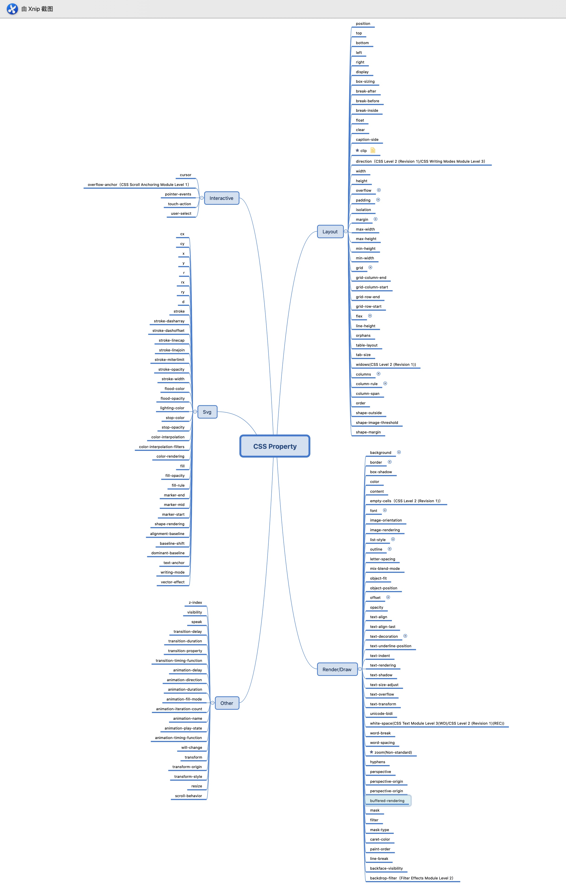

丁文婉 `<1067061570@qq.com>`, v1.0.0,  2020.06.04

[TOC]

# 重学CSS
## 动画
### Animation
- @keyframes定义动画，animation使用动画
- animation属性：
    - animation-name
    - animation-duration
    - animation-timing-function
    - animation-times
    - animation-delay
- keyframes的定义
    - keyframes：关键帧
    - from to（两个过程的情况） / 百分比定义动画的过程
    - 每个过程中元素的状态

### transition
- transition属性
    - transition-property
    - transition-duration
    - transition-timing-function
        - 以时间为x轴，以要变换的属性的百分比为纵轴的曲线
    - transition-delay

### bezier曲线

- 建议用ease来做位移类动画
- 退出建议用ease-in
- 进入建议用ease-out

## 颜色
### CMKY和RGB

- CMKY：印刷四色模式，由Cyan 青色、Magenta 品红、Yellow 黄色，blacK 黑色组成
- RGB：光的三原色，由红绿蓝组成

### HSL和HSV

- 色相（H）是色彩的基本属性，就是平常所说的颜色名称，如红色、黄色等；
- 饱和度（S）是指色彩的纯度，越高色彩越纯，低则逐渐变灰，取0-100%的数值；
- 明度（V），亮度（L），取0-100%；

## 形状
- border
- box-shadow
- border-radius
- data uri + svg（能满足画各种形状的需求）

# 重学HTML
## HTML的定义

- XML与SGML
- XML是SGML的子集
- 必知实体字符
    - quot
    - amp
    - lt
    - gt
- HTML使用多个空格的方法：CSS中加上white-space: pre-wrap或pre;
- 建议用双引号写html的属性

### DTD与namespace
- DTD在SGML的角度定义HTML（在HTML5中不再有效）
- HTML的namespace表示HTML里能用哪些标签

## HTML标签——语义
- 使用语义化标签的原则：不确定用就不用

- aside（页面的非主体）

- main(页面主体)
    - article
        - hgroup
            - h1
            - h2
        - div

        - header
        - footer

### 合法元素
- Element: <tagname>...</tagname>
- Text: text
- Comemnt: <!-- comments -->
- DocumentType: <!Doctype html>
- ProcessingInstruction: <?a 1?> (没啥用)
- CDATA: <![CDATA[]]>

### Browser API

- DOM
  - DOM Tree
  - Event
  - Range
- CSSOM
- BOM
- Web Animation
- Crypto
- ...

### DOM 

- Node
    - Element
    - Document
    - 
- 导航类操作
    - parentNode
    - childNodes（实时变化）
    - firstChild
    - lastChild
    - nextSibling
    - previousSibling
- 修改操作
    - appendChild
    - insertBefore
    - removeChild
    - replaceChild
- 高级操作
    - compareDocumentPosition 是一个用于比较两个节点中关系的函数
    - contains检查一个节点是否包含另一个节点的函数
    - isEqualNode 检查两个节点是否完全相同
    - isSameNode 检查两个节点是否是同一个节点，实际上在JavaScript中可以使用“===”
    - cloneNode复制一个节点，如果传入参数true，则会连同

### Events
- 同一个元素上一定是先捕获再冒泡
- 捕获：事件执行顺序是从父到子
- 冒泡：事件执行顺序是从子到父

- Tips：
    - 所有的dom操作都是W3C的标准
    - HTML多namespace共存，包括：HTML namespace、SVG namespace 和 MathML namespace
    - addEventListener第二个参数可以传一个对象，{handleEvent: function}

## 作业：用脑图的形式总结CSS的属性分类

