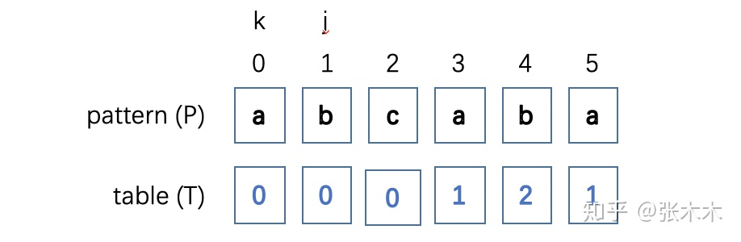
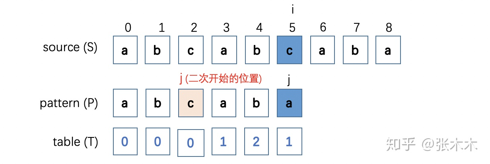

丁文婉 `<1067061570@qq.com>`, v1.0.0,  2020.06.27

[TOC]

# 编程训练

## 字符串分析算法
- 字典树（trie）
    - 大量字符串的完整模式匹配
- KMP
    - 长字符串中找子字符串 O(m+n)
- wildCard
    - 长字符串中找子字符串的升级版
- 正则
    - 字符串通用模式匹配
- 状态机
    - 通用的字符串分析
- LL LR
    - 字符串多层级结构分析

## 详解KMP算法

KMP是由 D.E.Knuth，J.H.Morris 和 V.R.Pratt提出的，用来在长字符串中找子串的经典算法。

在不理解KMP的情况下，看它的代码有点一头雾水的感觉，弄明白之后发现其实挺简单的，所以记录一下给自己加深理解。

KMP算法主要分两步：

第一步要计算样本字符串里每个字符前面重复字符串的长度信息，将该信息记录到一个与样本字符串一一对应的表里；
第二步将被匹配的源字符串与样本字符串进行一对一匹配，当源字符串与样本字符串失配时，样本字符串匹配指针回溯（回溯的位置由第一步产生的表决定），然后再重新匹配，如此循环直到匹配成功或匹配结束。
以 pattern="abcaba", source="abcabcabab" 为例，说一下算法的详细过程

**第一步：求解 table**



<center>图1</center>

table 每一位存放的是每个字符前（包括该字符）相同前缀和相同后缀的长度。相同的前缀和后缀可以理解为：字符串A可以由BS或VB组成（S、V为任意不为空的字符串），即：A = BS = VB，那么B就是字符串A相同的前缀和后缀。

table 的具体计算过程：

用k表示相同前后缀的位置，j 表示 pattern 的每个字符的位置

0) j=0，P[0] 前只有一个字符，没有相同的前后缀，故 table[0] = 0, j++，k=0;

1) k=0, j=1, P[k] !== P[j], 则 table[1] = 0, j++;

2) k=0, j=2, P[k] !== P[j], 则 table[2] = 0, j++;

3) k=0, j=3, P[k] === P[j], 则 table[3] = k+1=1, k++, j++;

4) k=1, j=4, P[k] === P[j], 则 table[4] = k+1=2, k++, j++;

6) k=0, j=5, P[k] === P[j], 则 table[5] = k+1=1。 k=0,

6) k=0, j=5, P[k] === P[j], 则 able[5] = k+1=1。

综上，table=[0, 0, 0, 1, 2, 1], 如图1所示。求解 table 的 js 代码如下：

```javascript
let table = new Array(pattern.length).fill(0);
let k = 0;
for(let j = 1; j < pattern.length; j++){
   if(pattern[j] === pattern[k]){
      k++;
   }else{
      while(k > 0 && pattern[k] !== pattern[j]){
         k = table[k-1];
      }
      if(pattern[k] === pattern[j]){
         k++;
      }else{
         k=0;
      }
   }
   table[j] = k;
}
```

**第二步：source 与 pattern 匹配**



<center>图2</center>

算法思路：

如图2所示，i 为 source 匹配的指针，j 为 pattern 的匹配指针，source 和 pattern从 i=0, j=0 开始一对一匹配，每次字符匹配成功 i 和 j 都向前走一步，当 source 和 pattern 失配时，即 i=5 处，j 应该回到哪个位置呢？答案是回到到 table[j-1] 也就是 2 的位置。

原因是在 i=5 和 j=2 处，它们的前面有相同的子串（对应求 table 表时相同的前缀和后缀），而在 i=5 时，pattern 前面的子串已经匹配过了，所以再次重新匹配时，j 应该回到与后缀相同的前缀的后一个字符的位置，然后再重新匹配，如此循环，直到匹配成功或者匹配结束。

source 匹配 pattern 的整体算法的 js 代码如下：

```javascript
function find(source, pattern){
    // table
    let table = new Array(pattern.length).fill(0);
    let k = 0;
    for(let j = 1; j < pattern.length; j++){
        if(pattern[j] === pattern[k]){
            k++;
        }else{
            // k=0;
            while(k > 0 && pattern[k] !== pattern[j]){
                k = table[k-1];
            }
            if(pattern[k] === pattern[j]){
                k++;
            }else{
                k=0;
            }
        }
        table[j] = k;
    }
    
    // source 与 pattern 匹配
    let j = 0;
    for(let i = 0; i < source.length; i++){
        if(source[i] === pattern[j]){
            j++;
        }else{
            while(source[i] !== pattern[j] && j > 0){
                j = table[j-1];
            }
            if(source[i] === pattern[j]){
                j++
            }else{
                j = 0;
            }
        }
        if(j === pattern.length){
            return true;
        }
    }
    return false;
}

```

**总结：**

如果用暴力法来做这种字符串匹配，一般都是两层嵌套，时间复杂度为O(mn), （m、n分别为source和pattern的长度），而KMP算法整体的时间复杂度为O(m+n)，空间复杂度为O(n)，在性能上得到了很大的提升。

该算法的难点在于理解table的求解过程，理解为什么要记录每个字符前相同前后缀的长度，理解了这些，也就掌握了KMP算法。
